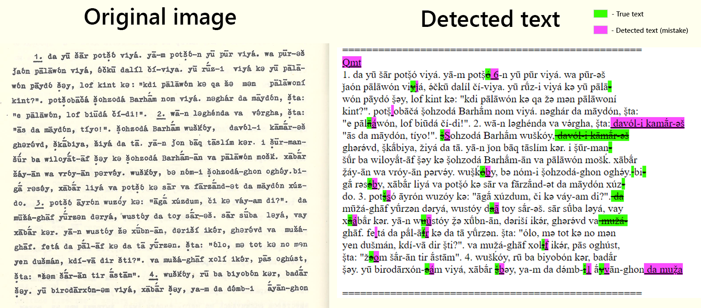

## OCR-Munji

Text detection of printed text in Munji language.

Detector created for book "Грюнберг А.Л. — Мунджанский язык Тексты"



### Alghoritm

The detector is based on Google cloud vision text detection with additional heuristics that recognize the characters of Munji language. A variety of heuristics are used, such as the correlation of special characters or signs and the replacement of some letters obtained by Google text detection. (See `detector/mapping.py`)

### Using 

#### Step 1

For use Google cloud vision you need to get [GOOGLE_APPLICATION_CREDENTIALS](https://cloud.google.com/vision/docs/detect-labels-image-client-libraries#before-you-begin) and set corresponding environment variable.

#### Step 2

Get Google cloud vision text detection response for image:
```commandline
python detector\google_ocr.py --image img.png --print-result
```
If command succeed, response saved as `.pickle` file.

#### Step 3

Get Munji text from image and google response:

```commandline
python -m detector tests/page148/img.png tests/page148/google_response.pickle
```

or simply
```commandline
python -m detector tests/page148/img.png
```
if response located in same dirictory with same filename as image.

**Result**

Resulted detected text located in `.txt`-file near `.pickle`-file.